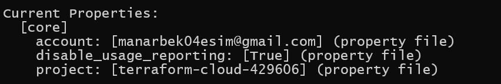
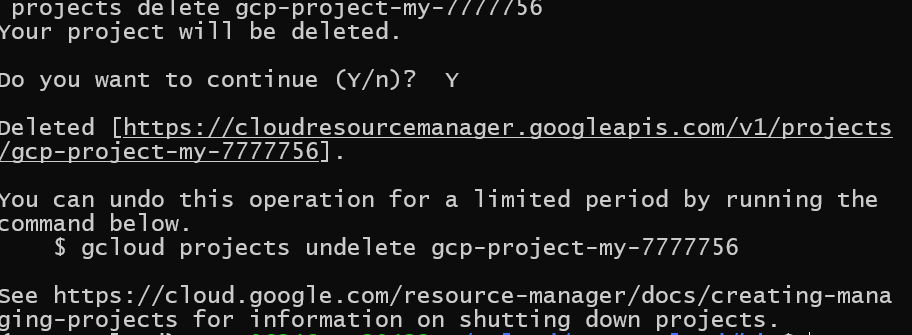
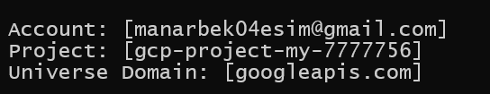
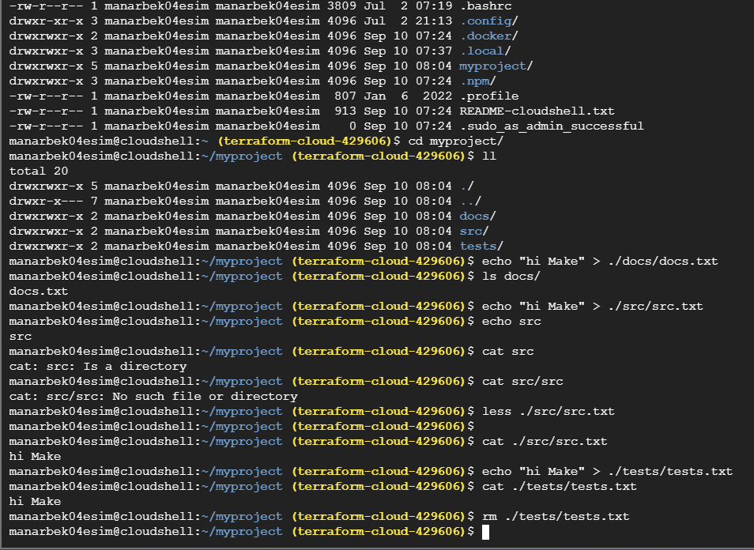

```
Exercise 1: Setting Up Google Cloud SDK
1. Objective: Install and configure the Google Cloud SDK on your local machine.
2. Steps:
○ Visit the Google Cloud SDK installation page.
○ Follow the instructions to download and install the SDK for your operating
system.
○ After installation, run gcloud init to initialize the SDK and authenticate with
your Google account.
○ Configure the default project and region.
○ Verify the installation by running gcloud version and gcloud info.
3. Questions:
○ What command did you use to authenticate with your Google account?
○ How did you set the default project?
○ What information does the gcloud info command provide?


```
## Answer:
1. gcloud init
2. I choose second project
3. Linux, Python versions. PATHs and properties
    

```
Exercise 2: Exploring Cloud Shell
1. Objective: Familiarize yourself with the Google Cloud Shell environment.
2. Steps:
○ Open the Google Cloud Console and activate Cloud Shell.
○ Explore the environment by listing files and checking the available tools.
○ Run the command gcloud config list to see your current configuration.
○ Create a directory named gcp-intro and navigate into it.
○ Use the built-in code editor to create a simple README.md file describing your
GCP project.
3. Questions:
○ What is the default home directory in Cloud Shell?
○ What tools are pre-installed in Cloud Shell?
○ How can you open the built-in code editor in Cloud Shell?
```

## ANSWERS:
1. standart home directory on UniX systems
2. 
```
drwxr-xr-x 1 root   root       4096 Aug 22 07:05 ./
drwxr-xr-x 1 root   root       4096 Aug 22 07:05 ../
-rwxr-xr-x 1 root   root       1045 Aug 22 07:05 apt-get*
-rwxr-xr-x 1 root   root        207 Aug 21 20:57 autopep8*
-rwxr-xr-x 1 root   root        564 Aug 21 21:03 bundle*
-rw-r--r-- 1 root   root          0 Aug 21 21:03 bundle.lock
-rwxr-xr-x 1 root   root        566 Aug 21 21:03 bundler*
-rw-r--r-- 1 root   root          0 Aug 21 21:03 bundler.lock
-rwxr-xr-x 1 root   root      20598 Aug 22 07:05 cloudshell*
-rwxr-xr-x 1 root   root       3848 Feb 27  2024 deploystack*
-rwxr-xr-x 1 root   root        263 Aug 21 20:57 django-admin*
-rwxr-xr-x 1 root   root        234 Aug 21 20:57 dmypy*
-rwxr-xr-x 1 root   root   16154160 Dec  7  2021 docker-compose*
-rwxr-x--x 1 205001  89939  6494854 Oct 18  2019 docker-credential-gcr*
-rwxr-xr-x 1 root   root   28201440 Dec  7  2021 docker-machine*
-rwxr-xr-x 1 root   root   47804996 Feb 27  2024 dsexec*
-rwxr-xr-x 1 root   root        230 Aug 21 20:49 easy_install*
-rwxr-xr-x 1 root   root        230 Aug 21 20:49 easy_install-2.7*
-rwxr-xr-x 1 root   root        219 Aug 21 20:58 epylint*
-rwxr-xr-x 1 root   root        527 Aug 21 21:03 erb*
-rwxr-xr-x 1 root   root        216 Aug 21 20:57 f2py*
-rwxr-xr-x 1 root   root       6333 Aug 21 20:57 fixup_datastore_admin_v1_keywords.py*
-rwxr-xr-x 1 root   root       6612 Aug 21 20:57 fixup_datastore_v1_keywords.py*
-rwxr-xr-x 1 root   root        214 Aug 21 20:57 flake8*
-rwxr-xr-x 1 root   root        208 Aug 21 20:57 flask*
-rwxr-xr-x 1 root   root        211 Aug 21 20:57 gce-v2v*
-rwxr-xr-x 1 root   root       4119 Aug 22 07:05 gcpdiag*
-rwxr-xr-x 1 root   root        585 Aug 21 21:04 gdb_wrapper*
-rw-r--r-- 1 root   root          0 Aug 21 21:04 gdb_wrapper.lock
-rwxr-xr-x 1 root   root        224 Aug 21 21:03 gem*
-rwxr-xr-x 1 root   root       2457 Aug 21 20:57 get_gprof*
-rwxr-xr-x 1 root   root       1651 Aug 21 20:57 get_objgraph*
-rwxr-xr-x 1   3434   3434 46374912 Aug 10  2022 helm*
-rwxr-xr-x 1 root   root        555 Aug 21 21:03 htmldiff*
-rw-r--r-- 1 root   root          0 Aug 21 21:03 htmldiff.lock
-rwxr-xr-x 1 root   root        247 Aug 21 20:57 import_pb_to_tensorboard*
-rwxr-xr-x 1 root   root        224 Aug 21 20:57 ipython*
-rwxr-xr-x 1 root   root        224 Aug 21 20:57 ipython3*
-rwxr-xr-x 1 root   root        525 Aug 21 21:04 irb*
-rw-r--r-- 1 root   root          0 Aug 21 21:04 irb.lock
-rwxr-xr-x 1 root   root        209 Aug 21 20:58 isort*
-rwxr-xr-x 1 root   root        243 Aug 21 20:57 isort-identify-imports*
-rwxr-xr-x 1 root   root   85958656 Dec  8  2023 istioctl*
-rwxr-xr-x 1 root   root        213 Aug 21 20:57 jsonschema*
-rwxr-xr-x 1 root   root        210 Aug 21 20:57 keyring*
lrwxrwxrwx 1 root   root         13 Aug 22 09:52 kf -> /google/kf/kf*
-rwxr-xr-x 1 root   root        555 Aug 21 21:04 kramdown*
-rw-r--r-- 1 root   root          0 Aug 21 21:04 kramdown.lock
-rwxr-xr-x 1 root   root       6108 Aug 22 07:05 kubectx*
-rwxr-xr-x 1 root   root       5555 Aug 22 07:05 kubens*
-rwxr-xr-x 1 root   root   15101952 Aug 21 21:05 kustomize*
-rwxr-xr-x 1 root   root        549 Aug 21 21:03 ldiff*
-rw-r--r-- 1 root   root          0 Aug 21 21:03 ldiff.lock
-rwxr-xr-x 1 root   root        220 Aug 21 20:57 markdown-it*
-rwxr-xr-x 1 root   root        214 Aug 21 20:57 markdown_py*
-rwxr-xr-x 1 root   root        230 Aug 21 20:57 mypy*
-rwxr-xr-x 1 root   root        213 Aug 21 20:57 mypyc*
-rwxr-xr-x 1 root   root        555 Aug 21 21:04 nokogiri*
-rw-r--r-- 1 root   root          0 Aug 21 21:04 nokogiri.lock
-rwxr-xr-x 1 root   root        233 Aug 21 20:57 normalizer*
-rwxr-xr-x 1   1001 docker 19955712 Sep 17  2021 pack*
-rwxr-xr-x 1 root   root        221 Aug 21 20:49 pip*
-rwxr-xr-x 1 root   root        221 Aug 21 20:49 pip2*
-rwxr-xr-x 1 root   root        221 Aug 21 20:49 pip2.7*
drwxr-xr-x 2 root   root       4096 Aug 21 20:57 __pycache__/
-rwxr-xr-x 1 root   root        212 Aug 21 20:57 pycodestyle*
-rwxr-xr-x 1 root   root        213 Aug 21 20:57 pydocstyle*
-rwxr-xr-x 1 root   root        211 Aug 21 20:57 pyflakes*
-rwxr-xr-x 1 root   root        215 Aug 21 20:57 pygmentize*
-rwxr-xr-x 1 root   root        217 Aug 21 20:58 pylint*
-rwxr-xr-x 1 root   root        233 Aug 21 20:57 pylint-config*
-rwxr-xr-x 1 root   root        212 Aug 21 20:57 pyls*
-rwxr-xr-x 1 root   root        223 Aug 21 20:58 pyreverse*
-rwxr-xr-x 1 root   root        212 Aug 21 20:57 pyrsa-decrypt*
-rwxr-xr-x 1 root   root        212 Aug 21 20:57 pyrsa-encrypt*
-rwxr-xr-x 1 root   root        210 Aug 21 20:57 pyrsa-keygen*
-rwxr-xr-x 1 root   root        233 Aug 21 20:57 pyrsa-priv2pub*
-rwxr-xr-x 1 root   root        206 Aug 21 20:57 pyrsa-sign*
-rwxr-xr-x 1 root   root        210 Aug 21 20:57 pyrsa-verify*
-rwxr-xr-x 1 root   root        531 Aug 21 21:03 racc*
-rw-r--r-- 1 root   root          0 Aug 21 21:03 racc.lock
-rwxr-xr-x 1 root   root        543 Aug 21 21:03 rackup*
-rw-r--r-- 1 root   root          0 Aug 21 21:03 rackup.lock
-rwxr-xr-x 1 root   root        549 Aug 21 21:04 rails*
-rw-r--r-- 1 root   root          0 Aug 21 21:04 rails.lock
-rwxr-xr-x 1 root   root        531 Aug 21 21:03 rake*
-rw-r--r-- 1 root   root          0 Aug 21 21:03 rake.lock
-rwxr-xr-x 1 root   root        525 Aug 21 21:04 rbs*
-rw-r--r-- 1 root   root          0 Aug 21 21:04 rbs.lock
-rwxr-xr-x 1 root   root        535 Aug 21 21:04 rdbg*
-rw-r--r-- 1 root   root          0 Aug 21 21:04 rdbg.lock
-rwxr-xr-x 1 root   root        583 Aug 21 21:04 rdebug-ide*
-rw-r--r-- 1 root   root          0 Aug 21 21:04 rdebug-ide.lock
-rwxr-xr-x 1 root   root        531 Aug 21 21:04 rdoc*
-rw-r--r-- 1 root   root          0 Aug 21 21:04 rdoc.lock
-rwxr-xr-x 1 root   root        603 Aug 21 21:04 reverse_markdown*
-rw-r--r-- 1 root   root          0 Aug 21 21:04 reverse_markdown.lock
-rwxr-xr-x 1 root   root        527 Aug 21 21:04 ri*
-rw-r--r-- 1 root   root          0 Aug 21 21:04 ri.lock
-rwxr-xr-x 1 root   root        549 Aug 21 21:04 rubocop*
-rw-r--r-- 1 root   root          0 Aug 21 21:04 rubocop.lock
-rwxr-xr-x 1 root   root   26812624 Aug 21 21:02 ruby*
-rwxr-xr-x 1 root   root        551 Aug 21 21:04 ruby-parse*
-rw-r--r-- 1 root   root          0 Aug 21 21:04 ruby-parse.lock
-rwxr-xr-x 1 root   root        555 Aug 21 21:04 ruby-rewrite*
-rw-r--r-- 1 root   root          0 Aug 21 21:04 ruby-rewrite.lock
-rwxr-xr-x 1 root   root        238 Aug 21 20:57 saved_model_cli*
-rwxr-xr-x 1 root   root        567 Aug 21 21:04 solargraph*
-rw-r--r-- 1 root   root          0 Aug 21 21:04 solargraph.lock
-rwxr-xr-x 1 root   root        216 Aug 21 20:57 sqlformat*
-rwxr-xr-x 1 root   root        211 Aug 21 20:57 stubgen*
-rwxr-xr-x 1 root   root        212 Aug 21 20:57 stubtest*
-rwxr-xr-x 1 root   root        219 Aug 21 20:58 symilar*
-rwxr-xr-x 1 root   root        593 Aug 21 21:03 syntax_suggest*
-rwxr-xr-x 1 root   root        256 Aug 21 20:58 tb-gcp-uploader*
-rwxr-xr-x 1 root   root        223 Aug 21 20:57 tensorboard*
-rwxr-xr-x 1 root   root        236 Aug 21 20:57 tflite_convert*
-rwxr-xr-x 1 root   root        248 Aug 21 20:57 tf_upgrade_v2*
-rwxr-xr-x 1 root   root        531 Aug 21 21:03 thor*
-rw-r--r-- 1 root   root          0 Aug 21 21:03 thor.lock
-rwxr-xr-x 1 root   root        531 Aug 21 21:03 tilt*
-rw-r--r-- 1 root   root          0 Aug 21 21:03 tilt.lock
-rwxr-xr-x 1 root   root     619864 Aug 21 20:55 tmux*
-rwxr-xr-x 1 root   root        236 Aug 21 20:57 toco*
-rwxr-xr-x 1 root   root        243 Aug 21 20:57 toco_from_protos*
-rwxr-xr-x 1 root   root        557 Aug 21 21:03 typeprof*
-rwxr-xr-x 1 root   root        587 Aug 21 20:57 undill*
-rwxr-xr-x 1 root   root        238 Aug 21 20:57 virtualenv*
-rwxr-xr-x 1 root   root      86800 Aug 21 20:48 vmtouch*
-rwxr-xr-x 1 root   root        208 Aug 21 20:57 wheel*
-rwxr-xr-x 1 root   root        211 Aug 21 20:57 yapf*
-rwxr-xr-x 1 root   root        235 Aug 21 20:57 yapf-diff*
-rwxr-xr-x 1 root   root        531 Aug 21 21:04 yard*
-rw-r--r-- 1 root   root          0 Aug 21 21:04 yard.lock
-rwxr-xr-x 1 root   root        535 Aug 21 21:04 yardoc*
-rw-r--r-- 1 root   root          0 Aug 21 21:04 yardoc.lock
-rwxr-xr-x 1 root   root        529 Aug 21 21:04 yri*
-rw-r--r-- 1 root   root          0 Aug 21 21:04 yri.lock
```
3. We can use VI/VIM/NANO

```
Exercise 3: Managing Projects with Google Cloud SDK
1. Objective: Use Google Cloud SDK to manage projects.
2. Steps:
○ List all the projects associated with your Google account using gcloud
projects list.
○ Create a new project with the command gcloud projects create
PROJECT_ID --name="My First GCP Project".
○ Set this new project as your default project.
○ Explore project metadata using gcloud projects describe PROJECT_ID.
○ Delete the project using gcloud projects delete PROJECT_ID after
completing the exercise.
3. Questions:
○ How do you list all projects associated with your account?
○ What command is used to set a default project?
○ How do you describe project metadata?

```

## ANSWERS:
1. 
    gcloud projects list
```
 projects describe gcp-project-my-7777756
createTime: '2024-09-10T07:42:41.162409Z'
lifecycleState: ACTIVE
name: My first GCP Project
projectId: gcp-project-my-7777756
projectNumber: '598791617629'
```
2. gcloud config set project
3. Date of creation, name, project number and id


```
Exercise 4: Using Cloud Shell for Basic Operations
1. Objective: Perform basic file and directory operations in Cloud Shell.
2. Steps:
○ In Cloud Shell, create a directory structure that mimics a small project (e.g.,
myproject/src, myproject/tests, myproject/docs).
○ Create a few files in these directories and use commands like touch, nano,
cat, and rm to manipulate them.
○ Use gsutil to create a new Cloud Storage bucket and upload a file from your
Cloud Shell environment.
○ Verify the file upload by listing the contents of the bucket.
3. Questions:
○ What command did you use to create the directory structure?
○ How did you upload a file to a Cloud Storage bucket?
○ How can you list the contents of a Cloud Storage bucket?
```
- mkdir -p myproject/src myproject/tests myproject/docs
- 

## ANSWER
1. mkdir -p
2. gsutil cp *.txt gs://my_bucket
3. Google cloud UI web site

```
Exercise 5: Automating Tasks with Shell Scripts in Cloud Shell
1. Objective: Write and execute a basic shell script in Cloud Shell.
2. Steps:
○ In Cloud Shell, create a new shell script named setup.sh in your gcp-intro
directory.
○ The script should automate the creation of a new directory, a simple text file, and
set up a basic Google Cloud configuration (e.g., set a default project).
○ Make the script executable using chmod +x setup.sh.
○ Run the script and verify that it performs the expected tasks.
3. Questions:
○ What command did you use to make the script executable?
○ How did you ensure the script was executed correctly?
○ What steps did your script automate?
```
## ANSWERS:
1. chmod +x setup.sh
2. I write the corresponding command
3. Create directory, file, and set default project
